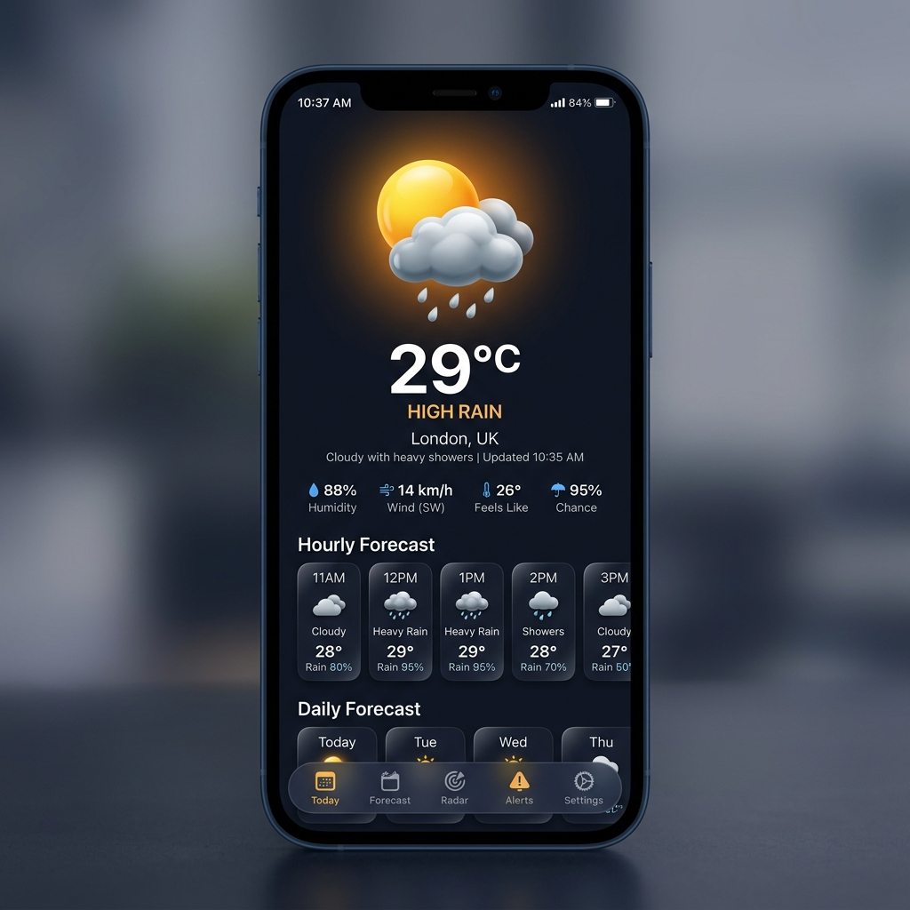

# 🌤️ Modern Dark Weather Mobile App

A modern, high-fidelity Flutter weather mobile application built with a dark glassmorphic design system, live Open-Meteo API integration, worldwide city geocoding search, and dynamic temperature-driven ambient theme transitions.

---

## 📸 App Preview

<p align="center">
  
</p>

---

## ✨ Features

- 🌙 **Premium Dark Aesthetic**: Near-black navy gradient background (`#0B0C11` to `#1A1C29`) with soft rounded corners (`16px–24px`) throughout.
- ☀️ **3D Weather Graphic**: High-fidelity stacked 3D weather graphic featuring a golden-amber sun sphere, soft 3D cloud, and glossy blue raindrops.
- 🎨 **Dynamic Temperature Themes**: Screen background gradient & radial hero glow automatically adapt in real-time based on live temperature:
  - 🧊 **Cold (< 15°C)**: Deep Arctic Navy with an Electric Cyan radial glow (`#00E5FF`).
  - 🌤️ **Mild (15°C – 25°C)**: Dark Navy with a Golden Amber radial glow (`#E67E22`).
  - 🔥 **Warm (> 25°C)**: Deep Sunset Crimson with a Fiery Red/Orange radial glow (`#FF5252`).
- 🔍 **Worldwide City & Country Search**: Search any city around the globe using Open-Meteo's live Geocoding API, complete with popular city quick-select chips (*London, Tokyo, Mumbai, Paris, New York, Dubai, Sydney, Addis Ababa*).
- 📊 **Detailed Weather Metrics**:
  - Main Temperature display with superscript `°C` formatting.
  - Condition string derived from WMO weather codes (e.g., *"Expect high rain today."*).
  - Wind speed (`km/h`), Humidity (`%`), and Apparent Temperature (`°C`).
  - Scrollable horizontal Hourly Forecast cards with formatted time labels (*"Now", "5pm", "6pm", "7pm"*).
- ⛵ **Custom Floating Navigation Bar**: Pill-shaped floating bottom bar featuring active highlight indicators.
- 🔄 **Resilient State Management**: Full StatefulWidget state handling for Loading state (custom indicator), Error state (user-friendly message + Retry button), and Success state with Pull-to-Refresh.

---

## 🛠️ Tech Stack & Packages

| Component | Technology / Package |
| :--- | :--- |
| **Framework** | [Flutter](https://flutter.dev) (Stable channel, Null-Safety) |
| **Language** | [Dart](https://dart.dev) (Dart 3.x) |
| **HTTP Requests** | [`http`](https://pub.dev/packages/http) |
| **Date & Time Formatting** | [`intl`](https://pub.dev/packages/intl) |
| **Typography** | [`google_fonts`](https://pub.dev/packages/google_fonts) (Inter) |
| **API Provider** | [Open-Meteo Weather API](https://open-meteo.com/) & Geocoding API |

---

## 📂 Project Architecture

```
weather_app/
├── assets/
│   └── images/
│       └── app_preview.png          # UI presentation mockup
├── lib/
│   ├── main.dart                    # App entrypoint & theme configuration
│   ├── models/
│   │   ├── location_model.dart      # Geocoding location model
│   │   └── weather_model.dart       # Current & Hourly weather data models
│   ├── services/
│   │   └── weather_service.dart     # HTTP Open-Meteo weather & geocoding service
│   ├── utils/
│   │   └── weather_utils.dart       # WMO code mapper & dynamic TempTheme generator
│   ├── screens/
│   │   └── home_screen.dart         # Main Weather Scaffold managing UI state lifecycle
│   └── widgets/
│       ├── custom_bottom_nav.dart   # Custom floating pill navigation bar
│       ├── header_row.dart          # Header bar (2-bar hamburger menu, location, calendar)
│       ├── hourly_forecast.dart     # Horizontal forecast card list
│       ├── search_dialog.dart       # Geocoding search bottom sheet modal
│       ├── stat_row.dart            # Wind, Humidity, and Apparent Temp row
│       ├── weather_hero.dart        # Ambient glow, giant temp & condition display
│       └── weather_icon_graphic.dart# 3D Sun + Cloud + Raindrop graphic widget
├── pubspec.yaml                     # Dependencies & assets configuration
└── README.md                        # Documentation
```

---

## 🚀 Getting Started

### Prerequisites

Ensure you have the following installed on your machine:
- [Flutter SDK](https://docs.flutter.dev/get-started/install) (3.19.0 or higher)
- [Dart SDK](https://dart.dev/get-started/sdk) (3.3.0 or higher)
- Google Chrome browser (for web preview) or Android Studio / Xcode (for mobile devices)

### Installation & Running

1. **Clone the repository**:
   ```bash
   git clone https://github.com/your-username/weather_app.git
   cd weather_app
   ```

2. **Install dependencies**:
   ```bash
   flutter pub get
   ```

3. **Run on Web (Chrome)**:
   ```bash
   flutter run -d chrome
   ```

4. **Run on Android / Mobile**:
   ```bash
   flutter run
   ```

5. **Build Release APK**:
   ```bash
   flutter build apk --release
   ```
   *The generated APK file will be saved to `build/app/outputs/flutter-apk/app-release.apk`.*

---

## 🌐 API Integrations

- **Forecast Endpoint**:
  ```
  https://api.open-meteo.com/v1/forecast?latitude={lat}&longitude={lng}&current=temperature_2m,relative_humidity_2m,apparent_temperature,precipitation,weather_code,wind_speed_10m,wind_direction_10m&hourly=temperature_2m,weather_code
  ```
- **Geocoding Search Endpoint**:
  ```
  https://geocoding-api.open-meteo.com/v1/search?name={query}&count=10&language=en&format=json
  ```

---

## 📄 License

This project is open source and available under the [MIT License](LICENSE).
